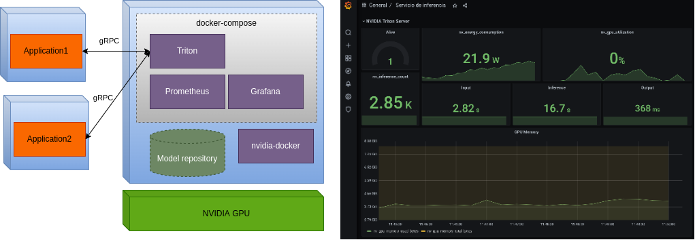

Servicio de inferencia con Triton
=================================

Docker-compose con Triton, Prometheus y Grafana.

.

**Instrucciones**

Iniciar servicio:

~~~bash
./up.sh
~~~

Detener servicio:

~~~bash
./down.sh
~~~

**Referencias**

- [NVIDIA Trtion Server slides](https://developer.download.nvidia.com/video/gputechconf/gtc/2019/presentation/s9438-maximizing-utilization-for-data-center-inference-with-tensorrt-inference-server.pdf)